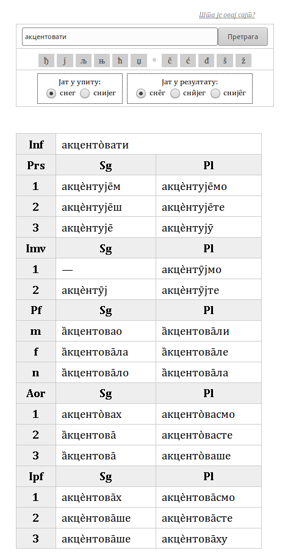

# jèzik

[](https://travis-ci.org/Zabolekar/jezik)

This will be a Serbian dictionary with detailed information about accent.

## Screenshots



## Web instance

You can find a running instance of this thing at <https://jezik.pythonanywhere.com/>.

## Requirements

* Python 3.7 or later
* Flask
* PyYAML

We also use `pytest` to run the tests, `mypy` for static type checking, and `coverage.py` to measure test coverage, but they are not necessary to run the code.

## Running it locally

To run the app locally for development purposes, do the following:

* Clone the repo to a directory named `jezik`
* Create and activate a virtual environment in a way you prefer
* Install the dependencies
  
  ```bash
  pip install -r requirements.txt
  ```

* Run the following script (it sets the needed environment variables and starts Flask):
  
  ```bash
  ./run.sh
  ```

  (on Windows cmd, use `run.bat` instead)
* Open <http://127.0.0.1:5000/>

## Using it without the web interface

You can use the underlying `lookup` function directly. It returns `Multitable` objects that can be queried in a flexible manner:

```python
>>> lookup("ауторски")["nom sg"]
 [nom sg]
m sg nom            а̀уторскӣ
f sg nom            а̀уторска̄
n sg nom            а̀уторско̄
```

However, the output may be incorrect depending on your console font. We've found Noto Mono and Fira Code to work well.

## Testing it locally

If the following commands give you errors, don't commit:

* `mypy ../jezik`
* `pytest`

The following commands might give you some useful hints, but don't trust them blindly:

* `pylint ../jezik`
* `flake8`

We also have configured `pytest --quick` to skip the most time-consuming tests but still perform the quick ones; this is useful during development.

You can measure test coverage like this:

```bash
coverage run -m pytest
# depending on what you want, add --branch after run and --quick after pytest
coverage report # for seeing a short report
coverage html # for generating a detailed report where you can browse files and see what wasn't executed
```

Don't let the results make you too optimistic. High coverage numbers can be reported even for files that don't have any automated tests at all (e.g. because some of their lines, like imports, class definitions, decorators etc. are executed during import).